<h1 align="center">SamFin AI Education Company</h1>
<p align="center">
  <strong>面向财经教育的 AI Native 平台</strong>
</p>

<p align="center">
  <a href="#"></a>
  <a href="#"></a>
  <a href="#"></a>
  <a href="#"></a>
  <a href="#"></a>
</p>

---

## SamFin 是什么

SamFin 是面向财经教育的 AI Native 一站式平台。平台围绕考试目标、学习周期、知识库、题库、学习记录和长期成长档案，为学生组织一支多对一的 AI 教学团队。

在 SamFin 中，教务总监负责接待和分流，教学团队以独立部门形式运营。每个团队配置班主任、主讲教授、教研总监、习题讲师和助教集群，通过公司通信图协同完成诊断、规划、授课、练习、复盘和续学。

<p align="center">
  
</p>

## 产品架构

### 平台入口

- 教务总监：平台前台，只负责收集考试目标和备考时间，并把学生移交给合适团队的班主任。
- 团队注册中心：注册专属课程课程
- 公司通信图：入口总监连接各团队班主任，由班主任组织团队内部教学资源。
- 会话权交接：完成分流后，同一 session 进入对应团队服务。

### 教学团队子图

五大团队都采用同一套高级 VIP 多对一服务结构：

- 班主任：团队第一责任人，接收教务总监移交，继续做学习诊断和服务组织。
- 主讲教授：负责核心知识点讲解、知识体系搭建、题目陷阱和答疑。
- 教研总监：负责阶段规划、测评策略、模考复盘和验收指标。
- 习题讲师：负责专属习题命题、题型拆解、例题讲练、错题归因和专项训练。
- 助教集群：负责并行执行教授派遣的工作，包括资料搜索、教学可视化交互工具制作、题库维护和进度跟踪。

## 五大王牌教学团队

SamFin 覆盖财经教育最有商业价值的考证和考研方向，形成五大王牌教学团队。每个团队都配置班主任、主讲教授、教研总监、习题讲师、助教集群、题库、知识库、学习进度表和长期成长档案。

| 团队 | 市场定位 | 核心产品能力 |
|---|---|---|
| CPA 注册会计师 VIP 团队 | 财会证书硬通货，面向审计、财务、投行、咨询和企业财务晋升 | 六科全程规划、会计/审计/财管重难点拆解、主观题训练、错题闭环、考前冲刺和跨年度续学 |
| 金融学 / 金融专硕 VIP 团队 | 财经考研主战场，覆盖金融学、金融专硕、金融科技与金融工程方向 | 431 金融学综合、396 经济类联考、货币金融、公司金融、投资学、热点论述和复试面试训练 |
| 会计专硕 / 会计职称 VIP 团队 | MPAcc、初级/中级/高级会计资格的高频刚需市场 | 管综逻辑写作、会计实务、财务管理、经济法、复试专业课和在职备考节奏管理 |
| 西方经济学 / 应用经济学 VIP 团队 | 经济学考研底层能力中心，服务应用经济学、产业经济学、区域经济学等方向 | 微观、宏观、计量基础、801/803/806 等院校专业课、模型推导、计算题和论述题训练 |
| 税务师 / 税务专硕 VIP 团队 | 财税垂直高价值赛道，覆盖税务师、税务专硕和企业税务实务 | 税法一/二、涉税服务实务、433 税务专业基础、税种知识图谱、政策更新和案例拆解 |

金融团队内置 CFA、FRM、量化金融和金融科技扩展线；会计团队内置审计、财管和企业财务管理扩展线。SamFin 按学习目标组织教学资源，为每名学生匹配专属 AI 教学团队。

## AI Native 生态蓝图

SamFin 的长期形态是三层生态：

- AI 公司系统：负责 agent 公司组织、团队通信图、会话权交接、教学职责边界和多 agent 协作。
- 工具系统：独立 MCP 工具服务，按 namespace 暴露 RAG、题库、代码沙箱、知识库、学习进度查询等能力，agent 按需获取工具。
- 用户系统：独立用户微服务，负责鉴权、用户档案、班级、聊天历史、学习进度、做题记录、购买权益和长期 summary。

最终平台会形成闭环：

1. 用户注册或登录。
2. 教务总监识别考试目标和备考时间。
3. 公司通信图将会话权交给对应团队班主任。
4. 班主任读取用户班级和学习进度窗口。
5. 教授、教研和助教工具围绕同一学习目标协作。
6. 本次学习结束后沉淀聊天记录、做题记录、学习进度和长期 summary。
7. 下一次进入时，团队基于历史记录继续服务。

## 技术方案

### Agent 编排

- Agency Swarm：表达公司级和团队级通信图，管理 agent 访问关系和会话交接。
- OpenAI Agents Runtime：托管单 agent 工具循环，替代历史手写 ReAct。
- Team Config：`team/<team_id>/config.yaml` 自描述团队元信息、入口、成员、工具、共享上下文和 prompt 路径。
- Team Prompts：团队 prompt 独立放在 `team/<team_id>/prompts/`，避免入口提示词和团队业务耦合。

### 整体通信架构

```mermaid
flowchart TB
    Client[Client / Frontend] --> Director[教务总监]

    subgraph Company[AI Company Service]
        Director --> Registry[团队注册中心]
        Registry --> CPA[CPA 团队班主任]
        Registry --> Finance[金融学 / 金融专硕团队班主任]
        Registry --> Accounting[会计专硕 / 会计职称团队班主任]
        Registry --> Economics[西方经济学 / 应用经济学团队班主任]
        Registry --> Tax[税务师 / 税务专硕团队班主任]

        subgraph CPATeam[CPA 教学团队]
            CPA <--> CPAProfessor[主讲教授]
            CPA <--> CPATeachingResearch[教研总监]
            CPA <--> CPAExercise[习题讲师]
            CPA --> CPAAssistants[助教集群]
        end

        subgraph FinanceTeam[金融学 / 金融专硕教学团队]
            Finance <--> FinanceProfessor[主讲教授]
            Finance <--> FinanceTeachingResearch[教研总监]
            Finance <--> FinanceExercise[习题讲师]
            Finance --> FinanceAssistants[助教集群]
        end

        subgraph AccountingTeam[会计专硕 / 会计职称教学团队]
            Accounting <--> AccountingProfessor[主讲教授]
            Accounting <--> AccountingTeachingResearch[教研总监]
            Accounting <--> AccountingExercise[习题讲师]
            Accounting --> AccountingAssistants[助教集群]
        end

        subgraph EconomicsTeam[西方经济学 / 应用经济学教学团队]
            Economics <--> EconomicsProfessor[主讲教授]
            Economics <--> EconomicsTeachingResearch[教研总监]
            Economics <--> EconomicsExercise[习题讲师]
            Economics --> EconomicsAssistants[助教集群]
        end

        subgraph TaxTeam[税务师 / 税务专硕教学团队]
            Tax <--> TaxProfessor[主讲教授]
            Tax <--> TaxTeachingResearch[教研总监]
            Tax <--> TaxExercise[习题讲师]
            Tax --> TaxAssistants[助教集群]
        end
    end

    Company --> ToolSystem[MCP Tool Service]
    Company --> UserSystem[User System Service]

    ToolSystem --> RAG[课程知识库 / RAG]
    ToolSystem --> QuestionBank[题库 / 错题 / 练习]
    ToolSystem --> Sandbox[代码沙箱 / 外部工具]

    UserSystem --> Auth[JWT 鉴权]
    UserSystem --> Profile[用户档案 / 班级]
    UserSystem --> Learning[学习进度 / 长期 Summary]
    UserSystem --> Chat[聊天历史 / 历史快照]
    UserSystem --> Exercise[做题记录]
    UserSystem --> Commerce[订单 / 课程权益]

    UserSystem --> Postgres[(PostgreSQL / PolarDB)]
    UserSystem --> Redis[(Redis Cache)]

```



### 数据和记忆

- PostgreSQL/PolarDB 是用户学习数据事实来源。
- Redis 是用户系统内部缓存，不暴露给 agent 主流程直接访问。
- Agent 运行期共享上下文只放摘要窗口和当前工作态，不长期保存用户学习档案。
- 学习进度采用 `user_id + class_id + chat_id` 等维度组织，支持同一用户在同一团队多次开班、多次学习周期和历史快照回看。

## 核心能力

- 多团队接待：教务总监统一接待学生，并按考试目标和学习周期分配教学团队。
- 多对一服务：班主任、主讲教授、教研总监、习题讲师和助教集群协同服务同一学习目标。
- 学习档案：围绕用户、班级、课程会话、学习进度、做题记录和长期 summary 建立连续记录。
- 工具生态：通过 MCP 服务连接知识库、题库、RAG、代码沙箱和外部工具。
- 配置化扩展：新增教学团队时，通过团队目录、团队配置和独立 prompt 扩展。

## 项目结构

```text
SamFin/
├── src/
│   ├── swarm/                  # Agency Swarm微服务
│   ├── user_system/            # 用户系统微服务
│   ├── mcp/                    # 独立 MCP 工具微服务
│   ├── sandbox/                # 独立 Sandbox 工具微服务
│   ├── harness/                # Agent Harness 库，不是独立微服务
│   ├── master/                 # 主后台微服务层
│   ├── config/                 # 配置加载和领域配置对象
│   └── schemas/                # 仍属于核心服务的共享 schema
├── team/
│   ├── cpa/
│   │   ├── config.yaml
│   │   ├── capabilities/
│   │   └── roles/
│   ├── finance/
│   ├── accounting/
│   ├── western_economics/
│   └── tax/
├── sql/            # 数据库
├── docker/            # docker部署
├── frontend/                   
├── docker-compose.yaml
├── config/                     # 各微服务独立配置
└── pyproject.toml
```

## 快速启动

### 1. 安装依赖

```bash
uv sync

cd frontend/

npm install
```

### 2. 准备配置

```bash
bash config.sh
```

至少填写配置：

- `llm.base_url`、`llm.model_name` 和模型 API Key 环境变量。
- `swarm.enabled_team_ids`，例如启用 `cpa`、`finance`、`accounting`、`western_economics`、`tax`。
- `user_system.host`、`user_system.port`、`user_system.postgres.dsn`、JWT secret/issuer/audience。
- `tool.mcp.endpoint` 或 MCP 服务 host/port。

### 3. 准备数据库

你需要先安装数据库并建表：

PostgreSQL 版本：

```bash
docker compose -f docker-compose.user-system.postgres.yaml up -d user-system-postgres user-system-redis
```

PolarDB 版本：

```bash
docker compose -f docker-compose.user-system.polardb.yaml up -d user-system-polardb user-system-redis
```

首次部署需要手动执行：

```bash
sql/user_system/001_auth.sql
sql/user_system/002_learning.sql
sql/user_system/003_chat.sql
sql/user_system/004_exercise.sql
sql/user_system/005_commerce.sql
```

### 4. 一键启动（同步启动所有微服务，适用于非分布式架构）

```bash
docker compose -f docker-compose.yaml up
```

也可以手动部署各个微服务（同样需要准备数据库）：

### 1. 启动用户系统服务

```bash
docker compose -f docker/docker-compose.user-system.yaml up
```

### 2. 启动 MCP 工具服务

```bash
docker compose -f docker/docker-compose.mcp.yaml up
```

### 3. 启动 Agency Swarm 服务

```bash
docker compose -f docker/docker-compose.agent.yaml up
```

### 4. 启动 sandbox 服务

```bash
docker compose -f docker/docker-compose.sandbox.yaml up
``` 

### 6. 启动前后端服务

```bash
docker compose -f docker/docker-compose.yaml
```

### 7. 也可以使用CLI：

```bash
uv run python -m src.cli
```

CLI 支持：

- `:graph` 查看公司通信图。
- `:calls` 查看 agent 间真实通信日志。
- `:progress` 查看学习进度上下文快照。
- `:trace` 查看上一轮内部过程。
- `:reset` 重置访客 session。

Python CLI 只是 swarm 微服务客户端；如果 swarm 服务未启动，会直接提示服务没有启动，不会在 CLI 进程内创建 swarm runtime。

## License

SamFin is released under the MIT License. See [LICENSE](LICENSE).

---

<p align="center"><strong>SamFin - 让每一个财经学习者背后都有一支 AI 教学公司</strong></p>
